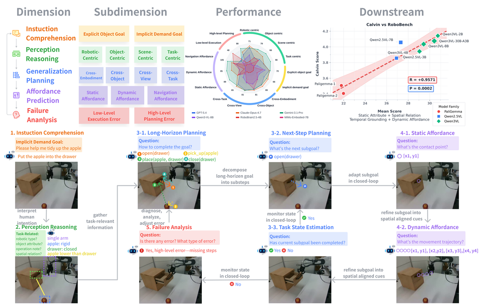

# Yulin Luo's Personal Homepage — Developer Notes

> 维护者：Yulin Luo
> 用途：记录本站搭建、部署、内容更新的流程与踩坑经验，避免重复踩坑。

---

## 1. 项目结构

- `_pages/about.md`：首页主体内容（About / News / Educations / Publications / Awards / Services / Interests）。
- `_config.yml`：站点元信息、作者、插件、SEO。
- `assets/css/accent-enhancements.css`：自定义样式（强调色、卡片、paper-short-name 等）。
- `images/`：头像、校徽、论文 teaser 图、favicon。
- `google_scholar_crawler/`：自动抓取 Google Scholar 引用数据。
- `_site/`：Jekyll 构建产物（已加入 `.gitignore`，不提交）。
- `Gemfile` / `Gemfile.lock`：Ruby 依赖。

---

## 2. 本地开发环境

### 2.1 安装 Ruby 和依赖

```bash
# Ubuntu/Debian
sudo apt-get update
sudo apt-get install -y ruby ruby-dev build-essential zlib1g-dev

# 安装 bundler
gem install bundler --no-document

# 安装项目依赖
cd /mnt/luoyulin_code/luoyulin/experience_v4/personal_web
bundle install
```

### 2.2 重要版本踩坑

- **不要使用 `github-pages` gem**。它锁定 Jekyll 3.9，与 Ruby 3.2 不兼容（会报 `undefined method 'tainted?'` 错误）。
- 本站使用 **Jekyll 4.x**（见 `Gemfile`）。
- **去掉 `hawkins`** 插件。它只支持 Jekyll 3.x，会导致 bundle 依赖冲突。
- 需要显式安装 `_config.yml` 里用到的插件：
  - `jekyll-paginate`
  - `jekyll-gist`
  - `jekyll-feed`
  - `jekyll-sitemap`
  - `jekyll-seo-tag`
  - `jekyll-redirect-from`

### 2.3 本地预览

```bash
bundle exec jekyll serve
# 打开 http://127.0.0.1:4000
```

### 2.4 资源命名规范

- 文件名只使用 **ASCII 字符**（字母、数字、`-`、`_`、`.`）。
- **不要**在文件名里用 `×`（乘号）等特殊符号，否则 Jekyll 构建会报编码错误。
- 参考：原来的 `favicon-32×32.png` 被重命名为 `favicon-32x32.png`。

---

## 3. 部署流程

本站采用 **GitHub Actions 官方 Pages 部署**：push 到 `main` 后，Actions 用 Jekyll 4.x 构建 `_site`，再通过 `actions/deploy-pages` 发布到 `https://yulin-luo.github.io/`。

这是 `username.github.io` 这类 **user site** 唯一可用的自动发布方式：user site 不能从 `gh-pages` 分支发布，只能从 `main` 分支由 GitHub 构建，或者通过 GitHub Actions 部署构建产物。

### 3.1 GitHub Pages 设置

1. 打开仓库 Settings → Pages。
2. Build and deployment → Source 选择 **GitHub Actions**。
3. 无需额外配置 workflow 文件，`.github/workflows/deploy.yml` 已包含完整流程。

### 3.2 本地构建验证（可选）

```bash
cd /mnt/luoyulin_code/luoyulin/experience_v4/personal_web
JEKYLL_ENV=production bundle exec jekyll build
```

构建产物在 `_site/`，可用于本地预览或排错。**不需要**手动推送到 `gh-pages`。

---

## 4. 内容更新规范

### 4.1 修改首页内容

编辑 `_pages/about.md`。

### 4.2 添加/修改论文

每篇论文使用如下结构：

```html
<div class='paper-box floating-card' data-tags="First/Co-First Author, Conference, CCF-A, Embodied AI, Benchmark">
  <div class='paper-box-image'>
    <div class="badge pulse-accent">ECCV 2026</div>
    
  </div>
  <div class='paper-box-text'>
    <h3>Paper Title</h3>
    <div class="paper-short-name">Short name: RoboBench</div>
    <p>Authors ...</p>
    <p><em>Conference/Journal Name</em> ...</p>
    <p>Links / Code / Project</p>
    <p><b>Highlight:</b> ...</p>
  </div>
</div>
```

### 4.3 论文 tag 分级体系

每篇论文的 `data-tags` 按以下层级分类：

- **作者位次**：`First/Co-First Author`、`Other`
- **中稿层次**：`CCF-A`、`CCF-B`、`Preprint`
- **中稿类型**：`Conference`、`Journal`、`Oral`、`Poster`
- **领域**：`Embodied AI`、`Computer Vision`、`Medical Imaging`、`Data-centric AI`
- **关注重心/技术路线**：`VLA`、`Benchmark`、`Agentic`、`World Model`、`MoE`、`Data Augmentation`、`MLLM`

避免散装的 tag，尽量落在上述层级里。

### 4.4 论文 teaser 图

- 推荐尺寸：宽度约 500px，高度约 300px。
- 来源：从 arXiv 下载源文件中的 PDF figure，然后转换/裁剪。
- 常用命令：

```bash
# 下载 arXiv 源
cd /tmp
wget https://arxiv.org/e-print/2409.16183 -O source.tar.gz
tar -xzf source.tar.gz

# 找到 figure PDF（通常在 figures/ 或主目录）
# 转换为 png
pdftoppm -png -r 150 figure.pdf output
# 或 ImageMagick
convert -density 150 figure.pdf -resize 500x300^ output.png
```

- 转换后放到 `images/` 目录，并在 `_pages/about.md` 中引用。
- 注意：某些 arXiv 论文源文件不是标准 gzip 格式，下载可能失败（如 Radiology VLM），此时保留占位图 `images/500x300.png`。

### 4.5 CV Selected Publications 排序规则

线上 CV 文件为 `files/Yulin_Luo_CV.pdf`。当前可维护源文件在：

```text
/mnt/luoyulin_code/luoyulin/paper/overleaf_cv_review/yulin_resume_62839b2f_20260705/resume_updated_draft.tex
```

编译目录在：

```text
/mnt/luoyulin_code/luoyulin/paper/overleaf_cv_review/yulin_resume_62839b2f_20260705/compile_check/
```

CV 的 `Education` 部分使用学校标题 + 轻量 bullet 结构：

- 第一行：学校名称，右侧时间。
- bullet 1：学位 + 学院/院系。
- bullet 2：导师；本科无导师时写 GPA / rank。

SJTU 本科经历按 2019--2023 的历史归属写：
`B.Eng. in Automation, School of Electronic Information and Electrical Engineering.`
不要改成 2024 年后成立/调整的 `School of Automation and Perception`。

更新 CV 论文列表时，`Selected Publications` 默认按以下优先级排序：

1. **作者贡献位次**：
   - 第一组：`Yulin Luo` 是最左一作的论文。
   - 第二组：`Yulin Luo` 是共同一作但不是最左作者的论文。
   - 第三组：其他合作论文。
2. **会议等级**：同一作者贡献组内，`CCF-A` 优先于 `CCF-B`。
3. **时间**：同一贡献组和同一 CCF 等级内，越新越靠前。
4. **机器人/具身相关性**：作为最后的 tie-break；机器人/具身智能主线论文优先。

当前确认顺序为：

1. Look Before Acting / ACM MM'26 / CCF-A / first author / VLA
2. RoboBench / ECCV'26 / CCF-B / first author / embodied benchmark
3. SSD-LLM / ECCV'24 / CCF-B / first author
4. MoASE / AAAI'26 Oral / CCF-A / co-first author
5. RandStainNA / MICCAI'22 / CCF-B / co-first author
6. MoFME / AAAI'24 / CCF-A / collaboration
7. RoboMIND / RSS'25 / CCF-B / collaboration / embodied data

更新流程：

```bash
CV_ROOT=/mnt/luoyulin_code/luoyulin/paper/overleaf_cv_review/yulin_resume_62839b2f_20260705
WEB_ROOT=/mnt/luoyulin_code/luoyulin/experience_v4/personal_web

cp "$CV_ROOT/resume_updated_draft.tex" "$CV_ROOT/compile_check/resume_updated_draft.tex"
cd "$CV_ROOT/compile_check"
xelatex -interaction=nonstopmode -halt-on-error resume_updated_draft.tex
xelatex -interaction=nonstopmode -halt-on-error resume_updated_draft.tex

cp "$CV_ROOT/compile_check/resume_updated_draft.pdf" "$WEB_ROOT/files/Yulin_Luo_CV.pdf"
cd "$WEB_ROOT"
JEKYLL_ENV=production bundle exec jekyll build
```

验证顺序：

```bash
pdftotext files/Yulin_Luo_CV.pdf - | sed -n '/Selected Publications/,/Research Internships/p'
pdftotext _site/files/Yulin_Luo_CV.pdf - | sed -n '/Selected Publications/,/Research Internships/p'
```

---

## 5. Google Scholar 引用自动更新

### 5.1 配置 Secret

1. 打开仓库 Settings → Secrets and variables → Actions。
2. New repository secret：
   - Name: `GOOGLE_SCHOLAR_ID`
   - Value: `SgeV4NkAAAAJ`

### 5.2 工作原理

- 爬虫脚本：`google_scholar_crawler/main.py`
- 使用 Python 标准库直接抓取并解析 Google Scholar profile HTML，避免 `scholarly` 长时间挂起。
- 生成两个 JSON 文件：
  - `results/gs_data.json`：完整学者数据。
  - `results/gs_data_shieldsio.json`：shields.io 格式引用数徽章。
- 通过 `.github/workflows/google_scholar_crawler.yaml` 每天 08:00 UTC 运行一次，结果推送到 `google-scholar-stats` 分支。
- 首页通过 jsdelivr CDN 读取该分支数据：
  ```html
  https://cdn.jsdelivr.net/gh/yulin-luo/yulin-luo.github.io@google-scholar-stats/gs_data.json
  ```

### 5.3 手动运行

```bash
cd google_scholar_crawler
GOOGLE_SCHOLAR_ID=SgeV4NkAAAAJ python main.py
```

---

## 6. 近期修复记录（2026-07-03）

### 6.1 重复的 `<html>` / `<head>` 标签

- **现象**：页面 `<head>` 内嵌套了第二个 `<html lang="en" class="no-js"><head><base target="_blank"></head>`，导致 HTML 结构不合法。
- **根因**：`_includes/head.html` 里误把 `<base target="_blank">` 包在 `<html><head>...</head>` 中。
- **修复**：只保留 `<base target="_blank">`，去掉多余的 `<html>` / `<head>` 闭合。

### 6.2 Publications 过滤器 JS 报错

- **现象**：下拉菜单选择后无反应，浏览器控制台报 `ReferenceError: filterContainer is not defined`。
- **根因**：`_pages/about.md` 的 JS 中直接用了未定义的 `filterContainer`。
- **修复**：改为 `const filterContainer = document.getElementById('filter-container');` 并加空值保护。

### 6.3 引用数改为动态更新

- **现象**：Highlight 卡片里“~785 citations”写死，Google Scholar 数据更新后不同步。
- **修复**：把数字包在 `<span id="total_cit">~785</span>` 中，让 `assets/js/main.min.js`（Google Scholar 数据脚本）自动替换。

### 6.4 GitHub Pages CDN 刷新延迟

- **现象**：本地 `_site/` 已确认修复，推送到 `gh-pages` 分支后，线上 `https://yulin-luo.github.io/` 仍短暂显示旧内容。
- **原因**：GitHub Pages 的 CDN 边缘缓存需要几分钟才能失效，缓存穿透参数（`?nocache=1`）也无效。
- **处理**：确认 `gh-pages` 分支内容正确后等待刷新；必要时可再推一次空 commit 触发重建。

### 6.5 部署架构修正：user site 不能从 gh-pages 发布

- **现象**：本地 `_site/` 和 `gh-pages` 分支都已更新，但线上 `https://yulin-luo.github.io/` 始终返回旧版（`Last-Modified: 2026-07-03 10:32:41 GMT`）。
- **根因**：仓库名为 `yulin-luo.github.io`，属于 **user site**。GitHub Pages 的 user/organization site 只能从 `main`/`master` 分支构建，或从 GitHub Actions 部署；**不能从 `gh-pages` 分支发布**。之前把构建产物推到 `gh-pages` 的 workflow 对该仓库无效。
- **修复**：
  - 重写 `.github/workflows/deploy.yml`，改用 `actions/upload-pages-artifact` + `actions/deploy-pages` 官方部署。
  - 仓库 Settings → Pages → Source 改为 **GitHub Actions**。
  - 删除 README-DEV.md 中关于手动推送到 `gh-pages` 的过时说明。

---

### 7.1 最初的 Jekyll Actions workflow 超时 6 小时

- 原因：GitHub cache 服务不稳定，`setup-ruby` 的 `bundler-cache: true` 卡住。
- 尝试：改为 `bundler-cache: false` + 手动 `bundle install`。
- 结果：build 能跑完，但 deploy 阶段仍偶发失败，并伴随 Node 20 deprecation 警告。

### 7.2 最终方案

放弃 GitHub Pages 的 artifact/deploy 流程，改用 **本地构建 + `gh-pages` 分支**。彻底绕开：

- `actions/deploy-pages` / `actions/upload-pages-artifact`
- Node 20 相关 deprecation 警告
- GitHub cache 服务不稳定

保留的 `.github/workflows/deploy.yml` 作为自动部署后备，但主流程以本地构建为准。

---

## 8. 常用命令速查

```bash
# 本地预览
bundle exec jekyll serve

# 生产构建（用于本地验证，Actions 会自动做同样的事）
JEKYLL_ENV=production bundle exec jekyll build

# 手动运行 Scholar 爬虫
cd google_scholar_crawler
GOOGLE_SCHOLAR_ID=SgeV4NkAAAAJ python main.py

# 触发 Google Scholar workflow（需要 gh CLI 并已登录）
gh workflow run google_scholar_crawler.yaml --repo yulin-luo/yulin-luo.github.io
```

---

## 9. TODO / 待完善

- [ ] 补齐剩余论文（MC-LLaVA、WoW、Wow-wo-val、MoASE++）的 teaser 图和 tag。
- [ ] 替换 Radiology VLM 的占位图。
- [ ] 删除/归档 David Dai 原模板的 `_posts/` 博客和 `self_introduction.md` 旧介绍。
- [ ] 决定 Interests 部分内容或移除该 section。
- [x] 修复 Publications 过滤器 JS 错误（`filterContainer` 未定义）。
- [x] 修复重复的 `<html>` / `<head>` 标签。
- [x] 引用数改为动态更新（`<span id="total_cit">`）。
- [x] Google Scholar 爬虫 workflow 已改为标准库解析器并设置 5 分钟超时。

---

## 10. 参考

- [AcadHomepage](https://github.com/RayeRen/acad-homepage.github.io) Jekyll theme
- [Jekyll 官方文档](https://jekyllrb.com/docs/)
- [GitHub Pages 文档](https://docs.github.com/en/pages)
- [Google Scholar profile](https://scholar.google.com/citations?user=SgeV4NkAAAAJ)
